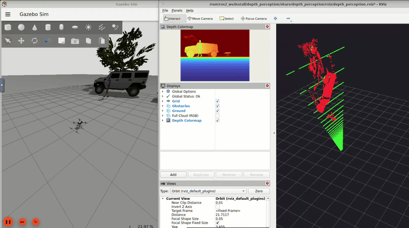

# Task 1 — Object Detection with YOLO

[fork](https://github.com/friaes/lecture8-perception)
ROS2 node that performs real-time YOLO object detection on the PX4 SITL camera stream.

## Step 1 — Build the Images

```bash
# Build everything
./build.sh --all

# Or build step by step
./build.sh --base  # ROS 2 + Gazebo
./build.sh --full  # PX4 Autopilot + MAVROS + NoVNC
```

## Step 2 — Start the container

```bash
docker compose up -d
# to close the container
docker compose down
```

## Step 3 — Build the ROS2 workspace

```bash
docker exec -it px4_sitl bash
cd /root/ros2_ws
source /opt/ros/jazzy/setup.bash
rosdep install --from-paths src --ignore-src -r -y
colcon build --symlink-install
source install/setup.bash
```

## Step 4 — Start the simulation (Terminal 1)

```bash
docker exec -it px4_sitl bash
cd /root/PX4-Autopilot
make px4_sitl gz_x500_depth
```

Access the GUI at: **http://localhost:6080/vnc.html** (password: `1234`)

Notes:
- The custom world file is mounted from `./worlds/aufgabe1_fuel_world.sdf`.

## Step 5 — Launch YOLO detection (Terminal 2)

```bash
docker exec -it px4_sitl bash
source /opt/ros/jazzy/setup.bash
source /root/ros2_ws/install/setup.bash

# Default: YOLOv8 nano (fastest)
ros2 launch yolo_detection yolo_detection.launch.py
```

The launch file automatically:
- Starts the ROS-Gazebo bridge (camera topic)
- Starts the YOLO inference node

## Step 6 — View the camera stream and detections

```bash
docker exec -it px4_sitl bash
source /opt/ros/jazzy/setup.bash
ros2 run rqt_image_view rqt_image_view /perception/image_annotated
```


---

# Task 2 — Depth Estimation & 3D Point Cloud Generation

ROS2 node that turns the PX4 SITL RGB-D stream into a coloured 3D point cloud and
separates **ground** from **obstacles** with a RANSAC plane fit. Package:
`depth_perception`. Depth comes from the `x500_depth` model's onboard depth camera
(the "depth camera" path allowed by the exercise); segmentation is pure NumPy —
no Open3D/PCL required.

Steps 1–3 (build images, start container, build the workspace) are identical to
Task 1. Use the same `x500_depth` simulation.

## Step 4 — Start the simulation (Terminal 1)

```bash
docker exec -it px4_sitl bash
cd /root/PX4-Autopilot
make px4_sitl gz_x500_depth
```

Access the GUI at: **http://localhost:6080/vnc.html** (password: `1234`)

## Step 5 — Launch the depth perception pipeline (Terminal 2)

```bash
docker exec -it px4_sitl bash
source /opt/ros/jazzy/setup.bash
source /root/ros2_ws/install/setup.bash

ros2 launch depth_perception depth_perception.launch.py
```

The launch file automatically:
- Publishes a static transform `world → camera_link` (so RViz2 has a TF tree)
- Starts the ROS-Gazebo bridge for the RGB, depth, and camera_info topics
- Starts the `point_cloud_node`
- Opens RViz2 with a preconfigured layout

## Pipeline overview

**Bridged inputs** (Gazebo → ROS 2):

| Gazebo topic | ROS 2 topic |
|--------------|-------------|
| `.../IMX214/image` | `/camera/color/image` |
| `.../IMX214/camera_info` | `/camera/color/camera_info` |
| `/depth_camera` | `/camera/depth/image` |
| `/depth_camera/points` | `/camera/depth/points` |

**Node outputs** (`point_cloud_node`):

| Topic | Description |
|-------|-------------|
| `/point_cloud/full` | full coloured cloud (XYZRGB) |
| `/point_cloud/ground` | RANSAC ground-plane points |
| `/point_cloud/obstacles` | non-ground / obstacle points (filtered cloud for downstream use) |
| `/depth/colormap` | false-colour depth image (near = warm, far = cold) |
| `/depth/stats` | per-frame point counts + processing time |

**How it works.** Each valid depth pixel `(u, v, Z)` is back-projected to 3D with
the pinhole model `X = (u − cx)·Z/fx`, `Y = (v − cy)·Z/fy` (camera optical frame:
X right, Y down, Z forward) and coloured from the latest RGB frame. RANSAC fits a
plane on a random subset of points and every point is then classified by its
distance to that plane; a plane is accepted as ground only if its normal is close
to vertical, otherwise all points are treated as obstacles. All clouds are stamped
with `camera_link` and published Best-Effort so a slow viewer can't back up memory.

## Step 6 — Visualize in RViz2

RViz2 opens automatically via the launch file with:
- **Obstacles** (`/point_cloud/obstacles`) in **red**
- **Ground** (`/point_cloud/ground`) in **green**
- **Full Cloud (RGB)** (`/point_cloud/full`) — toggle on for the photo-realistic cloud
- **Depth Colormap** (`/depth/colormap`)



## Launch / node parameters

| Parameter | Default | Meaning |
|-----------|---------|---------|
| `downsample_step` | `4` | pixel stride (density vs speed) |
| `max_depth` / `min_depth` | `10.0` / `0.1` | valid depth range [m] |
| `ransac_iters` | `100` | RANSAC iterations |
| `ransac_thresh` | `0.05` | inlier band [m] |
| `ransac_sample` | `4000` | points used to fit the plane |
| `ground_normal_tol` | `0.25` | min `|n_y|` to accept a plane as ground |
| `output_frame` | `camera_link` | frame stamped on all outputs |