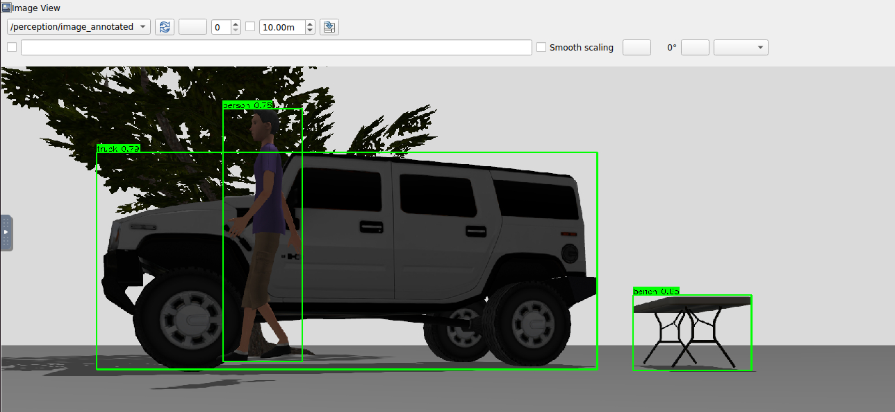

# Task 1 — Object Detection with YOLO

[fork](https://github.com/friaes/lecture8-perception)
ROS2 node that performs real-time YOLO object detection on the PX4 SITL camera stream.

## Step 1 — Build the Images

```bash
# Build everything
./build.sh --all

# Or build step by step
./build.sh --base  # ROS 2 + Gazebo
./build.sh --full  # PX4 Autopilot + MAVROS + NoVNC
```

## Step 2 — Start the container

```bash
docker compose up -d
# to close the container
docker compose down
```

## Step 3 — Build the ROS2 workspace

```bash
docker exec -it px4_sitl bash
cd /root/ros2_ws
source /opt/ros/jazzy/setup.bash
rosdep install --from-paths src --ignore-src -r -y
colcon build --symlink-install
source install/setup.bash
```

## Step 4 — Start the simulation (Terminal 1)

```bash
docker exec -it px4_sitl bash
cd /root/PX4-Autopilot
make px4_sitl gz_x500_depth
```

Access the GUI at: **http://localhost:6080/vnc.html** (password: `1234`)

Notes:
- The custom world file is mounted from `./worlds/aufgabe1_fuel_world.sdf`.

## Step 5 — Launch YOLO detection (Terminal 2)

```bash
docker exec -it px4_sitl bash
source /opt/ros/jazzy/setup.bash
source /root/ros2_ws/install/setup.bash

# Default: YOLOv8 nano (fastest)
ros2 launch yolo_detection yolo_detection.launch.py
```

The launch file automatically:
- Starts the ROS-Gazebo bridge (camera topic)
- Starts the YOLO inference node

## Step 6 — View the camera stream and detections

```bash
docker exec -it px4_sitl bash
source /opt/ros/jazzy/setup.bash
ros2 run rqt_image_view rqt_image_view /perception/image_annotated
```


---

# Task 2 — Depth Estimation & 3D Point Cloud Generation

ROS2 node that turns the PX4 SITL RGB-D stream into a coloured 3D point cloud and
separates **ground** from **obstacles** with a RANSAC plane fit. Package:
`depth_perception`. Depth comes from the `x500_depth` model's onboard depth camera
(the "depth camera" path allowed by the exercise); segmentation is pure NumPy —
no Open3D/PCL required.

Steps 1–3 (build images, start container, build the workspace) are identical to
Task 1. Use the same `x500_depth` simulation.

## Step 4 — Start the simulation (Terminal 1)

```bash
docker exec -it px4_sitl bash
cd /root/PX4-Autopilot
make px4_sitl gz_x500_depth
```

Access the GUI at: **http://localhost:6080/vnc.html** (password: `1234`)

## Step 5 — Launch the depth perception pipeline (Terminal 2)

```bash
docker exec -it px4_sitl bash
source /opt/ros/jazzy/setup.bash
source /root/ros2_ws/install/setup.bash

ros2 launch depth_perception depth_perception.launch.py
```

The launch file automatically:
- Publishes a static transform `world → camera_link` (so RViz2 has a TF tree)
- Starts the ROS-Gazebo bridge for the RGB, depth, and camera_info topics
- Starts the `point_cloud_node`
- Opens RViz2 with a preconfigured layout

## Pipeline overview

**Bridged inputs** (Gazebo → ROS 2):

| Gazebo topic | ROS 2 topic |
|--------------|-------------|
| `.../IMX214/image` | `/camera/color/image` |
| `.../IMX214/camera_info` | `/camera/color/camera_info` |
| `/depth_camera` | `/camera/depth/image` |
| `/depth_camera/points` | `/camera/depth/points` |

**Node outputs** (`point_cloud_node`):

| Topic | Description |
|-------|-------------|
| `/point_cloud/full` | full coloured cloud (XYZRGB) |
| `/point_cloud/ground` | RANSAC ground-plane points |
| `/point_cloud/obstacles` | non-ground / obstacle points (filtered cloud for downstream use) |
| `/depth/colormap` | false-colour depth image (near = warm, far = cold) |
| `/depth/stats` | per-frame point counts + processing time |

**How it works.** Each valid depth pixel `(u, v, Z)` is back-projected to 3D with
the pinhole model `X = (u − cx)·Z/fx`, `Y = (v − cy)·Z/fy` (camera optical frame:
X right, Y down, Z forward) and coloured from the latest RGB frame. RANSAC fits a
plane on a random subset of points and every point is then classified by its
distance to that plane; a plane is accepted as ground only if its normal is close
to vertical, otherwise all points are treated as obstacles. All clouds are stamped
with `camera_link` and published Best-Effort so a slow viewer can't back up memory.

## Step 6 — Visualize in RViz2

RViz2 opens automatically via the launch file with:
- **Obstacles** (`/point_cloud/obstacles`) in **red**
- **Ground** (`/point_cloud/ground`) in **green**
- **Full Cloud (RGB)** (`/point_cloud/full`) — toggle on for the photo-realistic cloud
- **Depth Colormap** (`/depth/colormap`)


Quick health check (Terminal 3):

```bash
ros2 topic echo /depth/stats --once
# e.g. frame=45 total_pts=118234 ground_pts=61120 obstacle_pts=57114 proc_ms=38.2
```

## Launch / node parameters

| Parameter | Default | Meaning |
|-----------|---------|---------|
| `downsample_step` | `4` | pixel stride (density vs speed) |
| `max_depth` / `min_depth` | `10.0` / `0.1` | valid depth range [m] |
| `ransac_iters` | `100` | RANSAC iterations |
| `ransac_thresh` | `0.05` | inlier band [m] |
| `ransac_sample` | `4000` | points used to fit the plane |
| `ground_normal_tol` | `0.25` | min `|n_y|` to accept a plane as ground |
| `output_frame` | `camera_link` | frame stamped on all outputs |

Override at launch, e.g. a denser cloud:

```bash
ros2 run depth_perception point_cloud_node --ros-args -p downsample_step:=2
```

---

# Übungsblatt 09 — Path Planning and Motion Control

Package: `path_planning`. Two nodes on top of the same PX4 SITL + `x500_depth`
setup:

- **Aufgabe 1 — Global Planner:** 3D collision-free path planning with **A\*** (default)
  or **RRT** on a voxel occupancy grid, with altitude constraints and no-fly zones,
  path visualization in RViz2, and execution on PX4 via MAVROS.
- **Aufgabe 2 — Local Planner:** real-time obstacle avoidance with **Artificial
  Potential Fields**, consuming the Task 2 obstacle cloud and sending velocity
  setpoints to PX4.

Planning is pure NumPy (no Octomap/OMPL/Nav2 needed). Everything is expressed in
the `map` frame (ENU, metres), which matches MAVROS local position and setpoints.

## Aufgabe 1 — Global 3D Path Planning

The planner builds a 3D voxel `OccupancyGrid3D` from:
- static obstacle boxes and no-fly cylinders (`params/scenario.yaml`),
- an altitude corridor `[altitude_min, altitude_max]`,
- optionally the live `/point_cloud/obstacles` from Task 2 (`use_live_cloud:=true`),

inflates obstacles by `robot_radius`, then searches with A\* (26-connected, with
no-corner-cutting) or RRT. The result is line-of-sight **shortcut** and published as
a `nav_msgs/Path` plus a `MarkerArray` (occupied voxels, start/goal, path line).

### Run (planning + visualization only)

```bash
docker exec -it px4_sitl bash
source /opt/ros/jazzy/setup.bash
source /root/ros2_ws/install/setup.bash

ros2 launch path_planning global_planning.launch.py            # A* (default)
ros2 launch path_planning global_planning.launch.py algorithm:=rrt
```

RViz2 opens on the `map` frame showing the occupancy grid, start (blue), goal
(yellow) and the green planned path. Set a new goal live with the **2D Goal Pose**
tool (publishes `/planner/goal`) or edit `goal:` in `params/scenario.yaml`.


### Fly the path on PX4 (execution)

**Terminal - MAVROS**

Run MAVROS: 

```bash
docker exec -it px4_sitl bash
ros2 launch mavros px4.launch fcu_url:=udp://:14540@localhost:14557
```

Start PX4 SITL and MAVROS first (Terminal 1 + MAVROS), then:

```bash
# Offboard (default): streams position setpoints, arms, follows waypoints
ros2 launch path_planning global_planning.launch.py execute:=true

# Mission upload: converts to GPS waypoints, AUTO.MISSION
ros2 launch path_planning global_planning.launch.py execute:=true exec_mode:=mission
```

The `mission_executor_node` subscribes to `/planner/path` and either streams
`/mavros/setpoint_position/local` setpoints (offboard) or uploads a mission via
`/mavros/mission/push` (mission), handling arming and mode switching.

### Key parameters (`params/scenario.yaml`)

| Parameter | Meaning |
|-----------|---------|
| `algorithm` | `astar` or `rrt` |
| `resolution` | voxel size [m] |
| `bounds` | `[xmin,xmax,ymin,ymax,zmin,zmax]` planning volume |
| `robot_radius` | obstacle inflation [m] |
| `altitude_min/max` | flight corridor [m] |
| `start` / `goal` | endpoints [m] |
| `obstacles` | flat list of boxes `[cx,cy,cz,sx,sy,sz, ...]` |
| `no_fly_zones` | flat list of cylinders `[cx,cy,r,zmin,zmax, ...]` |
| `use_live_cloud` | also block voxels from `/point_cloud/obstacles` |

## Aufgabe 2 — Local Obstacle Avoidance (Potential Fields)

`local_planner_node` flies toward a goal while reacting to obstacles in real time.
Obstacle points from `/point_cloud/obstacles` (camera frame) are converted to the
body FLU frame; an attractive velocity pulls toward the goal and a repulsive
velocity pushes away from nearby points. The combined velocity is rotated into the
ENU frame using the FCU yaw and published to `/mavros/setpoint_velocity/cmd_vel`.

### Run

Requires the Task 2 depth pipeline (for the obstacle cloud) plus PX4 SITL + MAVROS:

```bash
# Terminal A: depth perception (produces /point_cloud/obstacles)
ros2 launch depth_perception depth_perception.launch.py rviz:=false

# Terminal B: local planner
ros2 launch path_planning local_planning.launch.py goal:="[20.0, 0.0, 3.0]"
```

### Performance metrics

`local_planner_node` publishes `/local_planner/stats`:

```bash
ros2 topic echo /local_planner/stats
# reached=... traveled_m=... straight_m=... path_efficiency=... min_obstacle_dist_m=...
```

`path_efficiency` = straight-line distance / distance actually travelled (1.0 =
perfect), and `min_obstacle_dist_m` is the closest approach — run with different
`v_max` / obstacle configurations to compare success rate and efficiency.

### Key parameters

| Parameter | Meaning |
|-----------|---------|
| `goal` | target position (ENU) |
| `v_max` | max speed [m/s] |
| `k_att` / `k_rep` | attractive / repulsive gains |
| `influence_radius` | repulsion range `d0` [m] |
| `goal_tol` | success radius [m] |

## Build

```bash
cd /root/ros2_ws
colcon build --packages-select path_planning --symlink-install
source install/setup.bash
```

## Notes

- The A\*/RRT search, occupancy grid, shortcutting, altitude/no-fly handling and
  the potential-field frame math are all unit-tested offline. The MAVROS execution
  (offboard arming, mission upload) follows the standard PX4 patterns and should be
  verified in the loop — arm/OFFBOARD requires a steady setpoint stream (handled by
  the node) and a connected FCU.
- Octomap/OMPL/Nav2 are listed as tools but are not installed in the container;
  the planners are implemented directly instead, matching the Task 2 approach.